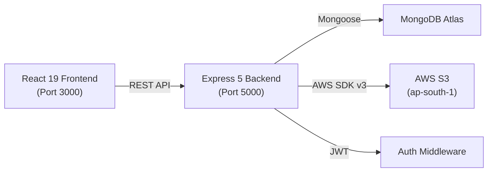

# ☁️ CloudVault — Digital Document Management System

**CloudVault** is a full-stack digital document management system designed to let users securely upload, organize, search, and manage their documents in the cloud. It features seamless integration with AWS S3 for storage and MongoDB Atlas for metadata.

---

## 🚀 Features

- **Secure Authentication:** User registration and login utilizing JWT and bcrypt (12 rounds).
- **Cloud Storage:** Direct file uploads to AWS S3 via memory buffers.
- **Document Management:** Full CRUD operations with pagination, folder organization, and custom tags.
- **Advanced Search:** Full-text search functionality across document names, descriptions, and tags.
- **Soft Delete & Recovery:** Move items to trash, restore them, or delete them permanently (removes from S3 & DB).
- **Secure File Access:** Time-limited presigned URLs for secure downloading and previewing.
- **Dashboard Analytics:** Visual insights with storage quota tracking and a Doughnut chart for file type distribution.
- **Modern UI:** Responsive sidebar layout, Framer Motion animations, and toast notifications for a premium user experience.

---

## 🏗️ Architecture & Tech Stack



| Layer | Technologies |
|-------|--------------|
| **Frontend** | React 19, React Router 7, Framer Motion, Chart.js, Axios, React Dropzone, Tailwind (assumed)/CSS |
| **Backend** | Express 5, Node.js, Mongoose 9, Multer 2, Helmet, Morgan |
| **Storage** | AWS S3 SDK v3 |
| **Database** | MongoDB Atlas |

---

## 📋 Prerequisites

Before you begin, ensure you have the following installed:
- [Node.js](https://nodejs.org/) (v16 or higher recommended)
- [MongoDB Atlas](https://www.mongodb.com/cloud/atlas) Account (or a local MongoDB instance)
- [AWS Account](https://aws.amazon.com/) with an S3 Bucket configured
- npm or yarn

---

## ⚙️ Installation & Setup

### 1. Clone the repository

```bash
git clone <your-repo-url>
cd "Digital Document Management System on Cloud"
```

### 2. Backend Setup

Navigate to the server directory and install dependencies:

```bash
cd server
npm install
```

Set up your environment variables:
1. Copy the example env file: `cp .env.example .env`
2. Open `.env` and fill in your credentials:
   - `PORT=5000`
   - `MONGO_URI=<Your MongoDB Connection String>`
   - `JWT_SECRET=<Your secure JWT secret>`
   - `AWS_ACCESS_KEY_ID=<Your AWS Access Key>`
   - `AWS_SECRET_ACCESS_KEY=<Your AWS Secret Key>`
   - `AWS_REGION=<Your AWS Region e.g., ap-south-1>`
   - `AWS_S3_BUCKET_NAME=<Your Bucket Name>`

Start the backend development server:

```bash
npm run dev
```

### 3. Frontend Setup

Open a new terminal, navigate to the client directory, and install dependencies:

```bash
cd client
npm install
```

Start the React development server:

```bash
npm start
```

The application will be running at `http://localhost:3000`.

---

## 🔌 API Reference

### Authentication (`/api/auth`)
- `POST /api/auth/register` - Register a new user
- `POST /api/auth/login` - Authenticate and receive a JWT
- `GET /api/auth/me` - Get current user profile (Protected)

### Documents (`/api/documents`)
- `GET /api/documents` - List documents (Supports pagination, search, filters)
- `POST /api/documents/upload` - Upload a new file (multipart/form-data)
- `GET /api/documents/stats` - Get storage statistics
- `GET /api/documents/trash` - Retrieve soft-deleted documents
- `GET /api/documents/:id` - Get details of a single document
- `PUT /api/documents/:id` - Update document metadata (name, tags, folder, etc.)
- `DELETE /api/documents/:id` - Move document to trash (Soft delete)
- `PUT /api/documents/:id/restore` - Restore a trashed document
- `DELETE /api/documents/:id/permanent` - Permanently delete a document
- `GET /api/documents/:id/download` - Generate a presigned S3 download URL
- `GET /api/documents/:id/preview` - Generate a presigned S3 preview URL

---

## ⚠️ Security Notes
- **Never commit your `.env` file.** Ensure `.env` is listed in your `.gitignore` to prevent leaking MongoDB credentials and AWS Keys.
- The default setup includes a global DNS override in `server/config/db.js` (`dns.setServers()`). You may want to remove or adjust this depending on your hosting environment.

---

## 🔮 Future Roadmap
- Rate limiting for authentication endpoints to prevent brute-force attacks.
- Enhanced input sanitization on document metadata.
- In-app file preview modals for supported file types.
- Password reset/forgot password flows via email.
