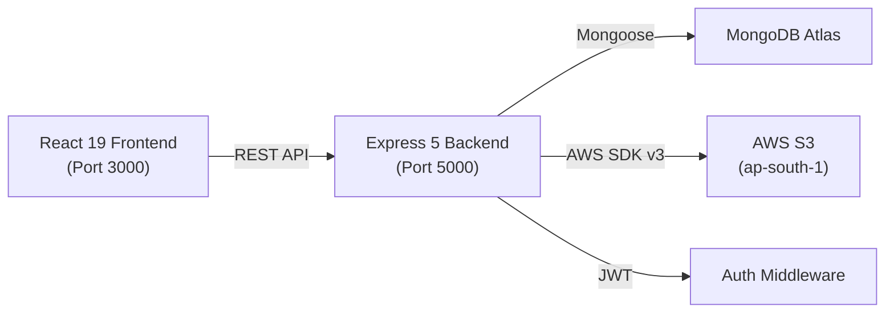

# ☁️ CloudVault — Digital Document Management System on Cloud

## Project Summary

**CloudVault** is a full-stack **document management system** built as a Project-Based Learning (PBL) project. It allows users to register, login, upload documents to **AWS S3**, manage them with metadata stored in **MongoDB Atlas**, and perform operations like search, favorite, trash/restore, and permanent delete.

---

## Architecture



| Layer | Tech Stack |
|-------|-----------|
| **Frontend** | React 19, React Router 7, Framer Motion, Chart.js, Axios, react-toastify, react-dropzone, react-icons |
| **Backend** | Express 5, Mongoose 9, Multer 2 (memory storage), Helmet, Morgan, bcryptjs, jsonwebtoken |
| **Storage** | AWS S3 (`cloudvault-077` bucket, `ap-south-1` region) |
| **Database** | MongoDB Atlas (SRV connection) |
| **Auth** | JWT (7-day expiry), bcrypt (12 rounds) |

---

## File Structure

```
Digital Document Management System on Cloud/
├── client/                          # React frontend (CRA)
│   ├── src/
│   │   ├── App.js                   # Routes & auth guards
│   │   ├── context/
│   │   │   └── AuthContext.js       # Auth state management
│   │   ├── services/
│   │   │   └── api.js               # Axios instance + API wrappers
│   │   ├── components/
│   │   │   ├── Layout/
│   │   │   │   ├── Header.js        # Top bar with menu, notifications, avatar
│   │   │   │   ├── Sidebar.js       # Nav sidebar with storage indicator
│   │   │   │   └── Layout.css       # Layout styles
│   │   │   ├── Common/              # (empty — planned)
│   │   │   └── Documents/           # (empty — planned)
│   │   ├── pages/
│   │   │   ├── Login.js             # Login page
│   │   │   ├── Register.js          # Registration page
│   │   │   ├── Dashboard.js         # Stats, recent docs, storage chart
│   │   │   ├── Documents.js         # Document list with filters
│   │   │   ├── Upload.js            # File upload with drag & drop
│   │   │   ├── Search.js            # Full-text search
│   │   │   └── Trash.js             # Trash management
│   │   ├── styles/                  # (empty)
│   │   ├── index.css                # Global styles & design tokens
│   │   └── App.css                  # App-level styles
│   └── package.json
│
└── server/                          # Express backend
    ├── server.js                    # Entry point, middleware, routes
    ├── config/
    │   ├── db.js                    # MongoDB connection (Google DNS fix)
    │   └── s3.js                    # AWS S3 client config
    ├── models/
    │   ├── User.js                  # User schema (bcrypt, JWT)
    │   └── Document.js              # Document schema (S3 metadata, soft delete)
    ├── middleware/
    │   └── auth.js                  # JWT bearer token verification
    ├── controllers/
    │   ├── authController.js        # Register, Login, GetMe
    │   └── documentController.js    # Full CRUD + S3 operations
    ├── routes/
    │   ├── authRoutes.js            # POST /register, /login; GET /me
    │   └── documentRoutes.js        # All document CRUD routes
    ├── utils/                       # (empty — planned)
    ├── .env                         # Environment variables
    └── package.json
```

---

## API Endpoints

### Auth (`/api/auth`)

| Method | Endpoint | Access | Description |
|--------|----------|--------|-------------|
| POST | `/register` | Public | Register with name, email, password |
| POST | `/login` | Public | Login, get JWT |
| GET | `/me` | Private | Get current user |

### Documents (`/api/documents`)

| Method | Endpoint | Description |
|--------|----------|-------------|
| POST | `/upload` | Upload file (multipart, max 50MB) |
| GET | `/` | List documents (pagination, filters, search) |
| GET | `/stats` | Storage stats & file type distribution |
| GET | `/trash` | Get trashed documents |
| GET | `/:id` | Get single document |
| GET | `/:id/download` | Get S3 presigned download URL |
| GET | `/:id/preview` | Get S3 presigned preview URL |
| PUT | `/:id` | Update metadata (name, tags, folder, favorite) |
| DELETE | `/:id` | Soft delete (move to trash) |
| PUT | `/:id/restore` | Restore from trash |
| DELETE | `/:id/permanent` | Permanent delete (S3 + MongoDB) |

---

## Key Features

| Feature | Status |
|---------|--------|
| ✅ User registration & login (JWT) | Done |
| ✅ File upload to AWS S3 via memory buffer | Done |
| ✅ Document CRUD with pagination | Done |
| ✅ Soft delete / trash / restore | Done |
| ✅ Permanent delete (S3 + DB) | Done |
| ✅ Presigned download & preview URLs | Done |
| ✅ Full-text search (MongoDB `$text`) | Done |
| ✅ Favorites | Done |
| ✅ Folder organization | Done |
| ✅ Tags | Done |
| ✅ Storage quota tracking (100MB default) | Done |
| ✅ Dashboard with Doughnut chart | Done |
| ✅ Responsive sidebar + header layout | Done |
| ✅ Framer Motion animations | Done |
| ✅ Toast notifications | Done |

---

## Client Pages

| Page | Route | Description |
|------|-------|-------------|
| Login | `/login` | Email/password login form |
| Register | `/register` | Name/email/password registration |
| Dashboard | `/dashboard` | Stat cards, recent docs, storage chart |
| Documents | `/documents` | Filterable, paginated document grid |
| Upload | `/upload` | Drag & drop file upload |
| Favorites | `/favorites` | Documents filtered by `isFavorite` |
| Search | `/search` | Full-text search across name, description, tags |
| Trash | `/trash` | Soft-deleted documents with restore/permanent delete |

---

## Security Observations

> [!CAUTION]
> **Exposed secrets in `.env` file**
> The `.env` file contains **hardcoded production credentials**:
> - MongoDB Atlas URI with username & password
> - AWS Access Key ID and Secret Access Key
> - JWT Secret
>
> These should be **rotated immediately** if this repo has been pushed to any public location (GitHub, etc.). Use `.env.example` with placeholder values instead.

> [!WARNING]
> **DNS Override in `db.js`**
> The code sets `dns.setServers(['8.8.8.8', '8.8.4.4', '1.1.1.1'])` globally to fix ISP DNS blocking. This overrides DNS for the entire Node.js process, which could have unintended side effects on other network operations.

> [!NOTE]
> **`v4: uuidv4` import from `'crypto'`** in `documentController.js` (line 10) is imported but never used — the code actually uses `crypto.randomUUID()` on line 17. The `uuidv4` destructuring import is incorrect (Node's `crypto` doesn't export a named `v4`).

---

## Potential Improvements

1. **Rate limiting** — No rate limiting on auth endpoints (brute force risk)
2. **Input sanitization** — Express-validator is used for auth but not for document metadata updates
3. **Error handling** — The 404 handler is a 3-arg middleware, so Express won't call the 4-arg error handler after it
4. **Empty component directories** — `Common/`, `Documents/`, `styles/`, and `utils/` are empty placeholders
5. **File preview** — The preview endpoint generates presigned URLs but the frontend doesn't have a preview modal
6. **CORS** — Currently set to `http://localhost:3000` only; needs configuration for production deployment
7. **Storage quota enforcement** — Only checked on upload; bulk operations could bypass it
8. **No password reset flow** — No forgot/reset password endpoint
